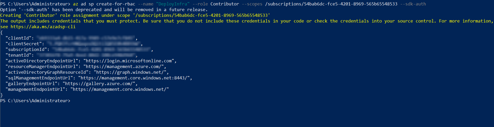
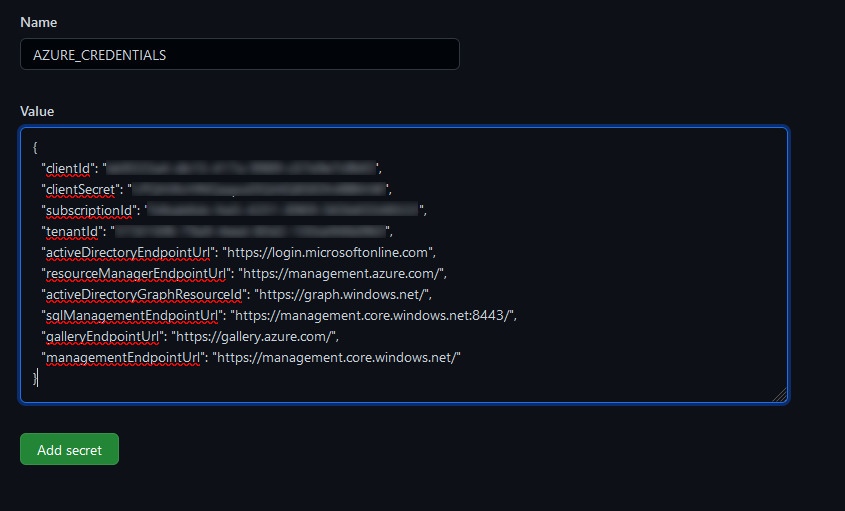
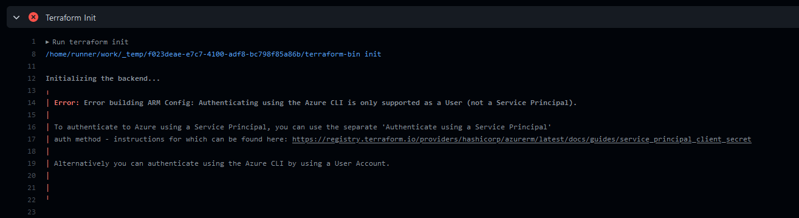
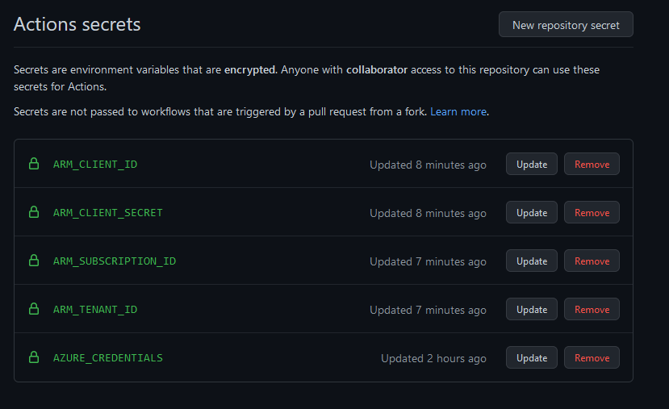
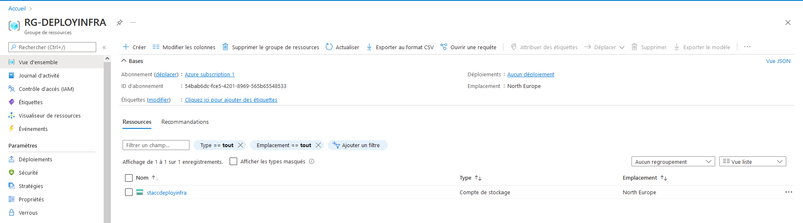
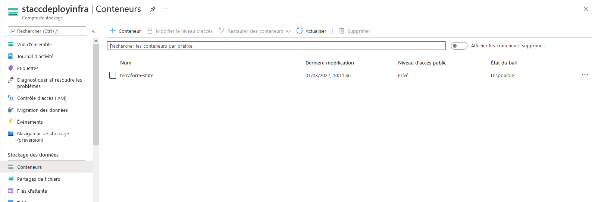

# Déploiement de l'infra du projet via terraform\ansible\github actions

## Pré-requis
### Création du dépôt git

On crée un readme ainsi qu'un .gitignore spécifique à terraform

### Création d'un principal de service azure

Si vous utilisez des applications, des services hébergés ou des outils automatisés qui doivent accéder aux ressources ou les modifier, vous pouvez créer une identité pour l’application. Cette identité est connue en tant que principal de service. L’accès aux ressources est limité par les rôles attribués au principal du service, ce qui vous permet de contrôler quelles ressources sont accessibles et à quel niveau. 

Dans un premier temps, nous allons nous connecter sur azure pour ensuite lancer la commande suivante:

```cmd
az ad sp create-for-rbac --name "DeployInfra" --role Contributor --scopes /subscriptions/<numero de subscription> --sdk-auth
```

On récupère dans la sortie les crédentials pour accéder à nore applcation.



### Création des secrets dans le depôt git

On se rend alors sur notre repo sur github, on va dans settings puis secrets\Actions et on crée le secret suivant:

    AZURE_CREDENTIALS



#### Attention!

Au moment, ou le github action va executer terraform (avec terraform init),il va renvoyer un message d'erreur:


 Error: Error building ARM Config: Authenticating using the Azure CLI is only supported as a User (not a Service Principal).

To authenticate to Azure using a Service Principal, you can use the separate 'Authenticate using a Service Principal'
auth method - instructions for which can be found here: https://registry.terraform.io/providers/hashicorp/azurerm/latest/docs/guides/service_principal_client_secret

Alternatively you can authenticate using the Azure CLI by using a User Account.



On va donc créer 4 secrets:

	ARM_CLIENT_ID
	ARM_CLIENT_SECRET
	ARM_SUBSCRIPTION_ID
	ARM_TENANT_ID

qui correspondent aux 4 premières lignes de l'output de la commande éxecutée plus haut.


### Création d'un compte de stockage

On va créer ensuite un compte de stockage pour hébérger notre fichier d'état Terraform tfstate. (Indispensable lorsqu'on travaille en équipe sinon le fichier est en local)

On crée un groupe

```cmd	
az group create -g RG-DEPLOYINFRA -l northeurope
```

Puis un groupe de stockage dans ce groupe
	
```cmd
az storage account create -n staccdeployinfra -g RG-DEPLOYINFRA -l northeurope --sku Standard_LRS
```

Si on se rend dans notre interface azure, on retrouve les ressources que nous venons de créer:




Enfin, on crée un container dans ce groupe de stockage
	
```cmd
az storage container create -n terraform-state --account-name staccdeployinfra
```

